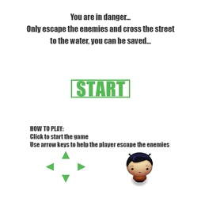
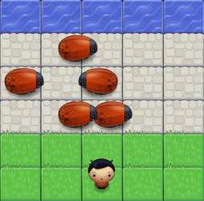
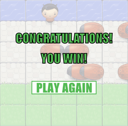

# arcade-game

This is a 2D game clone of the classic arcade game Frogger, created mainly based on HTML5 Canvas API and JavaScript and is the [project](https://github.com/udacity/frontend-nanodegree-arcade-game) of Udacity's Front-End Web Developer Nanodegree.

This game can be simply divided into three states: start, loop and win state. Screenshots for them are as followed:

+ start state:

+ loop state:

+ win state:

### Run

##### Play Online
+ Click [here](http://lu3xiang.top/arcade-game/) and have a try

##### Run It Locally
+ Download or clone this repository
+ Open index.html in your browser

### Play

+ Click **START** button to begin
+ Use the arrow keys in your keyboard to control the player
+ If you collide with bugs, game will reset
+ When you escape enemies and reach the water safely, you win and can play again

